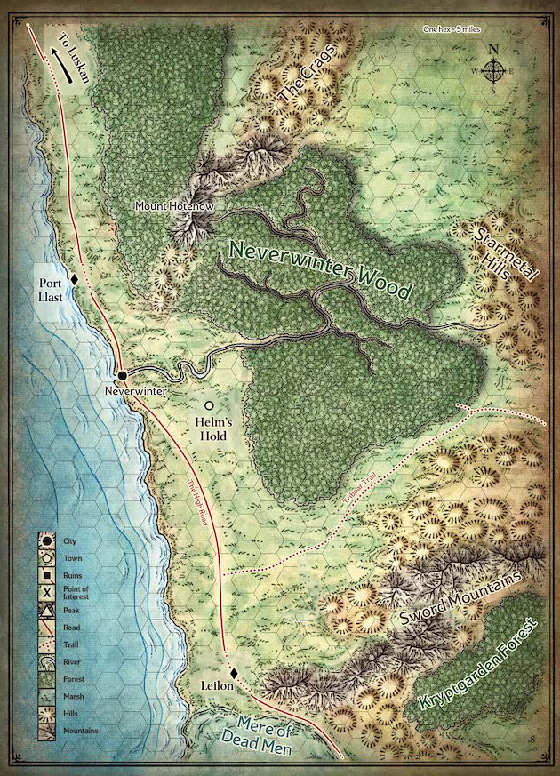

[Back to main page](index.md)
# Locations

## Map

## Specific Places

**Helm's Hold** - Fortified city east of Neverwinter with a cathedral dedicated to Helm

**Venturer's Rest** - Tavern in Helm's Hold known to cater to adventurers

**Peltham** - small fur trapper village east of Helm's Hold, on the edge of Neverwinter Wood

**Neverwinter Wood** - vast woodland filled with mystery, magic, and danger

**The Moonglade** -- a magical clearing in Neverwinter Wood where items can be imbued with magic during the full moon. Guarded by powerful centaurs