[Back to main page](index.md)
# NPCs Encountered So Far
(In order of appearance)
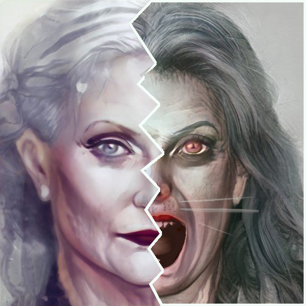
**Suttar Troden** (deceased) - wererat woman who posed as owner of The Venturer's Rest and lured adventurers into a deathtrap, defeated by PCs

**Silus** - owner and proprietor of The Venturer's Rest in Helm's Hold, grateful to PCs for rescuing him from Suttar

**Grigor** - attempted to trick the party into gathering Skullroot berries for him in the fur trapper village of Peltham, seen laughing during the manticore cub incident in Helm's Hold

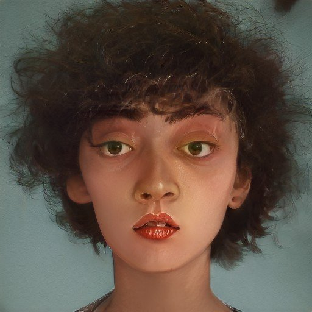
**Miri/Marius** - street urchin in Helm's Hold, played Grigor's ailing "son" when Grigor attempted to trick the party into gathering Skullroot berries

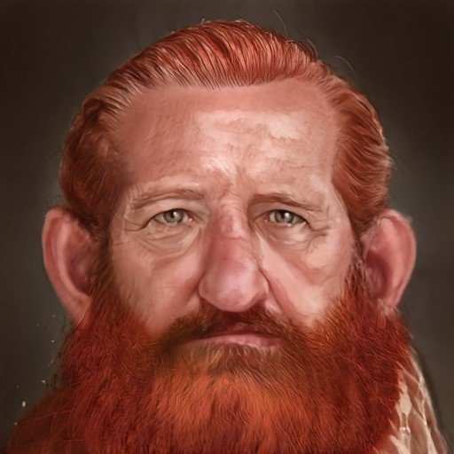
**Rangrim Brawnanvil** - dwarven blacksmith in Helm's Hold, suspicious of adventurers, refuses to forge weapons but will repair armour

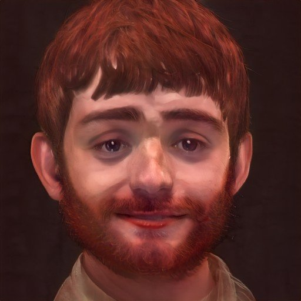
**Reed Goodbarrel** - halfling gambler accidentally injured by Piet

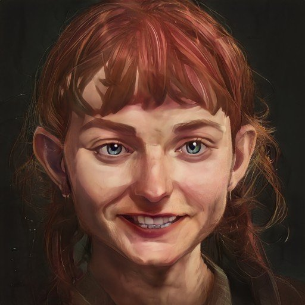
**Cora Goodbarrel** - halfling acolyte of Helm, local healer, sister to Reed

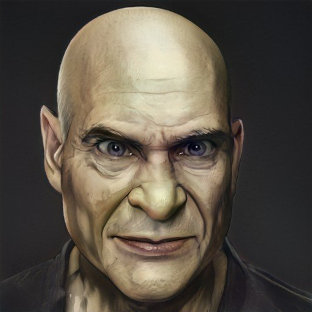
**Mol the Pious** - priest of Helm

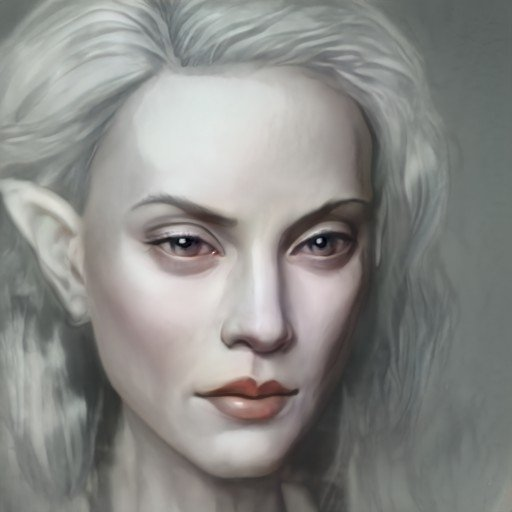
**Alethra Moonwhisper** - elven traveller, concerned the local logging camps are disrespecting the natural world

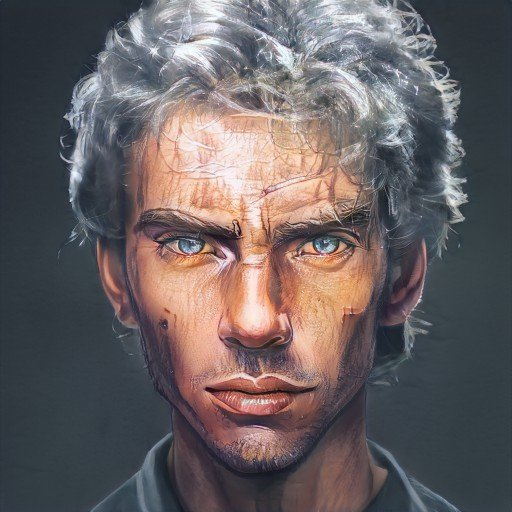
**Ketoth Troden** - knight, brother of Suttar, keen to find out what happened to her

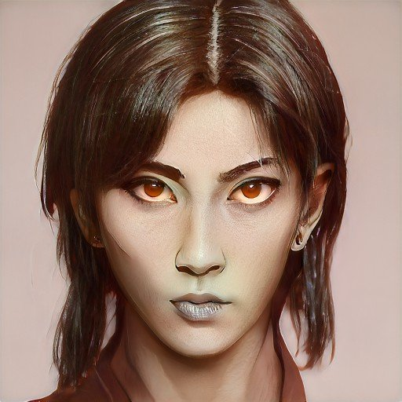
**Arizma Wen** - mercenery (Zhentarim), owner of Clangianthus the clockwork dragon

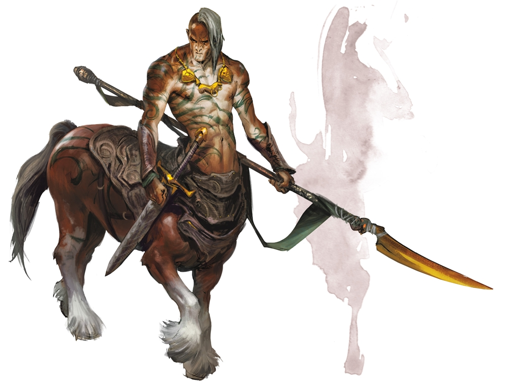
**Ilikan** - leader of a tribe of centurs who guard The Moonglade in Neverwinter Wood

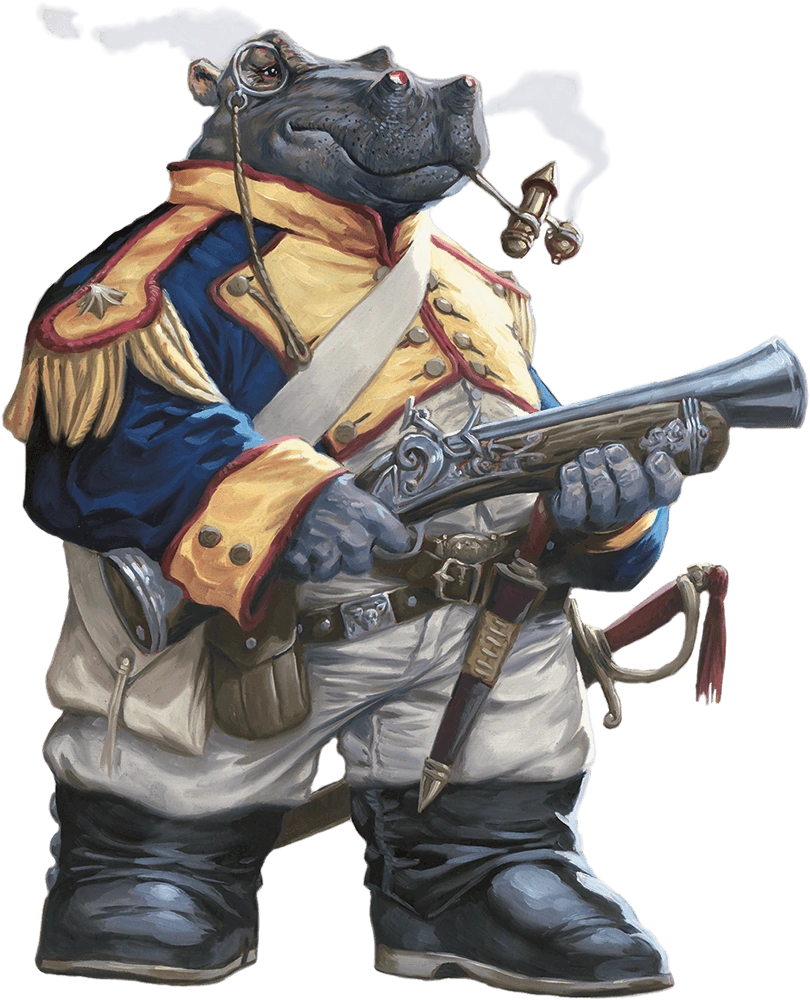
**Horatio Arcanolius** - captain of "the Fastbrite" - a ship capable of intersetllar travel, jettisoned into Neverwinter Wood by an escape pod ("the lifering"), seeking chardalyn crystals to refuel his ship

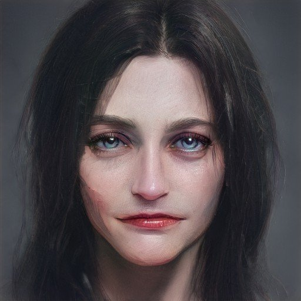
**Shy Luna** - a shy and mysterious inhabitant of Helm's Hold

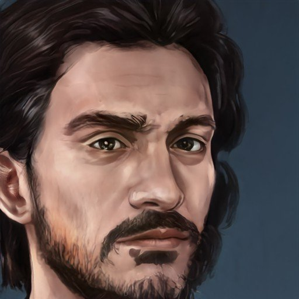
**Ivan Basha** - Grigor's son, a member of the Harpers, who is looking for his father and afraid he has fallen in with a bad crowd

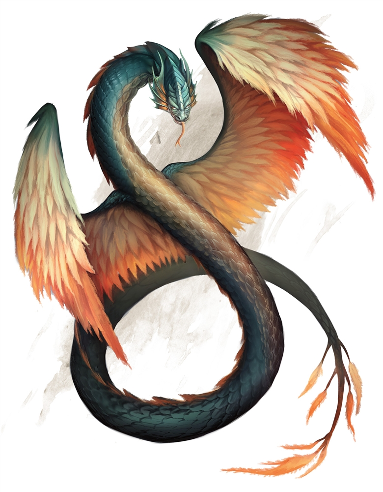
Salamathur - A magnificent being from another realm who has asked the party to root out the evil shapeshifters conspiring in and around Helm's Hold